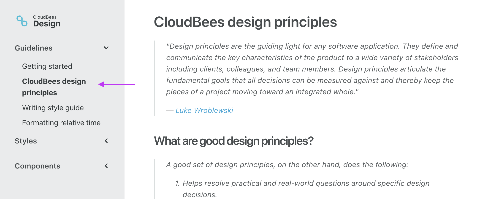

This document details how the active links highlighting for the navigation is done.



The active links highlighting is performed as part of a Gulp task, specifically the Markdown process which is found in the file:

```
gulp/tasks/markdown.js
```

## activeLink function

Within the markdown gulp there is a function called `activeLink` which is the function that generates the markup for the active nav link. The purpose of the function is to find the current page that is being rendered and then locate the link in the side nav to highlight.

The `activeLink` function takes two required parameters. The first parameter is the markup for the page that is currently being rendered. The second parameter is the title of the document page that is being rendered.

The markup is then passed to [cheerio](https://github.com/cheeriojs/cheerio) which is used to generate a DOM with the markup. Cheerio is a library which allows us to use jQuery functions from a server side implementation.

With the DOM loaded, we then check to see if a title was supplied from the second parameter. If it was supplied then it looks through the DOM to find the nav link that contains a value of the title. Once found, a `is-active` class is added. The next thing that happens is that the closest grouping is found by traversing the DOM and is expanded using the `is-expanded` class.

Finally the rendered HTML is returned so that the document could be rendered with the active side bar link.

## Calling the activeLink function

The `activeLink` function is called within a `.pipe` where `gulp-data` exposes the data stream.

```
.pipe($.data(function(file) {
  let title = JSON.stringify(file.data.title)
  file.contents = new Buffer(activeLink(String(file.contents), title))
}))
```

First the title of the document is extracted to be passed as one of the parameters for the `activeLink` function.

From the data stream, the contents of the doc is also extracted. This is the rendered HTML where the handlebars has been compiled. This is because we want to crawl the markdown using cheerio from the `activeLink` function.

Once the highlighted markdown is returned, the data has to be converted to a Buffer which is done by passing the `activeLink` function into `new Buffer`. It is then reassigned back to the `file` object on the `contents` key.

